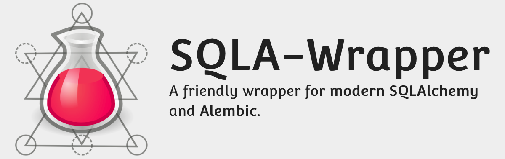

A friendly wrapper for [modern SQLAlchemy](https://docs.sqlalchemy.org/en/14/glossary.html#term-2.0-style) (v1.4 or later) and Alembic.

**Documentation:** https://sqla-wrapper.scaletti.dev/

Includes:

- A SQLAlchemy wrapper, that does all the SQLAlchemy setup and gives you:
    - A scoped session extended with some useful active-record-like methods and pagination helper.
    - A declarative base class.
    - A helper for performant testing with a real database.

    ```python
    from sqla_wrapper import SQLAlchemy

    db = SQLAlchemy("sqlite:///db.sqlite", **options)
    # You can also use separated host, name, etc.
    # db = SQLAlchemy(user=…, password=…, host=…, port=…, name=…)
    ```

- An Alembic wrapper that loads the config from your application instead of from separated `alembic.ini` and `env.py` files.

    ```python
    from sqla_wrapper import Alembic, SQLAlchemy

    db = SQLAlchemy(…)
    alembic = Alembic(db, "db/migrations")
    ```

